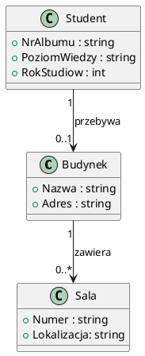

# Diagram klas UML (Unified Modeling Language)

```plantuml
@startuml

class Budynek {
    +Nazwa : string
    +Adres : string
}

class Sala {
    +Numer : string
    +Lokalizacja: string
}

class Student { 
    +NrAlbumu : string
    +PoziomWiedzy : string
    +RokStudiow : int
}

Budynek "1" --> "0..*" Sala : zawiera
Student "1" --> "0..1" Budynek: przebywa

@enduml
```